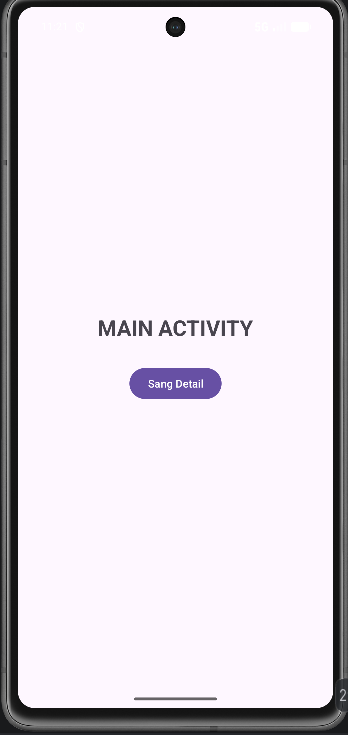
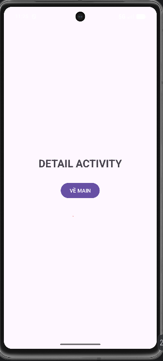

# BT Trên lớp - Activity

Bài tập trên lớp môn Lập trình Thiết bị Di động - Chủ đề Activity & Intent (Android).

---

## 📱 Kết Quả Thực Hành (Screenshots)

### 🖼️ Màn hình ứng dụng

| Màn hình chính (MainActivity) | Màn hình chi tiết (DetailActivity) |
| :---: | :---: |
|  |  |

---

## 🛠️ Thông tin Dự án
- **Ngôn ngữ:** Kotlin
- **IDE:** Android Studio
- **Nội dung:** Thực hành Activity Lifecycle, Intent truyền dữ liệu qua lại giữa các Màn hình.

## 🚀 Cách chạy ứng dụng
1. Mở dự án trong Android Studio.
2. Chờ Sync Gradle thành công.
3. Chọn thiết bị giả lập (Emulator) hoặc thiết bị Android thật và bấm **Run (Shift + F10)**.
